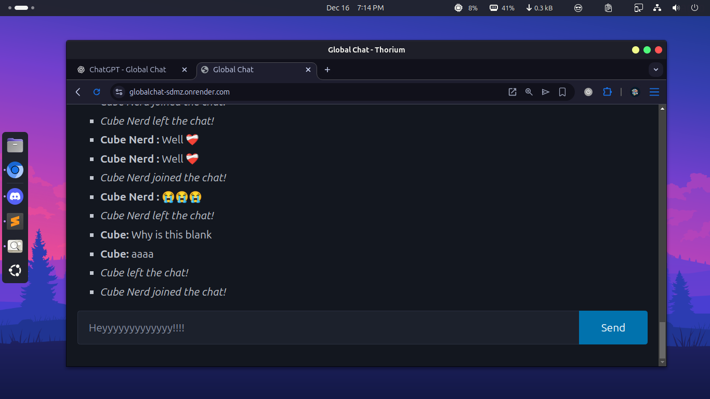

# GlobalChat 🌍💬

A simple **real-time global chat app** built with **Express**, **Socket.IO**, and **Vue 3**.
Made as a learning project to understand WebSockets, real-time systems, and PWAs.

🌐 **Live demo:** [https://globalchat-sdmz.onrender.com/](https://globalchat-sdmz.onrender.com/)

📸 **Preview**


## ✨ Features

* Real-time global chat using **Socket.IO**
* Username chosen on first visit (saved in `localStorage`)
* System messages for user **join / leave**
* Message history on connect (in-memory)
* Send via **Enter** or **Send** button
* Installable **Progressive Web App**
* Minimal UI with **Pico.css**
* Reactive frontend with **Vue 3 (CDN)**

## 🛠 Tech Stack

### Server


### Client


## 🔄 How It Works

1. The client asks for a **user** on first visit and stores it in `localStorage`
2. The browser connects to the Socket.IO server, sending the username during the handshake
3. The server:

   * Sends existing messages to the new client
   * Broadcasts a **join** system message
4. When a user sends a message:

   * It is sent to the server
   * Stored in memory ( for now )
   * Broadcast to all connected clients
5. On disconnect, the server broadcasts a **leave** system message
6. Vue updates the UI reactively as messages arrive

That’s it — no polling, no page refreshes.

## 🚀 Running Locally
```sh
git clone [https://github.com/mastercuber55/GlobalChat](https://github.com/mastercuber55/GlobalChat)
cd GlobalChat
npm install
node index.js
```
Server runs at: http://localhost:8080

## ⚠️ Limitations

* No authentication currently
* Messages stored in RAM only currently
* Single global room for now
* No spam protection or moderation
* No markdown support yet

## 📄 License

MIT — free to fork, modify, and learn from.